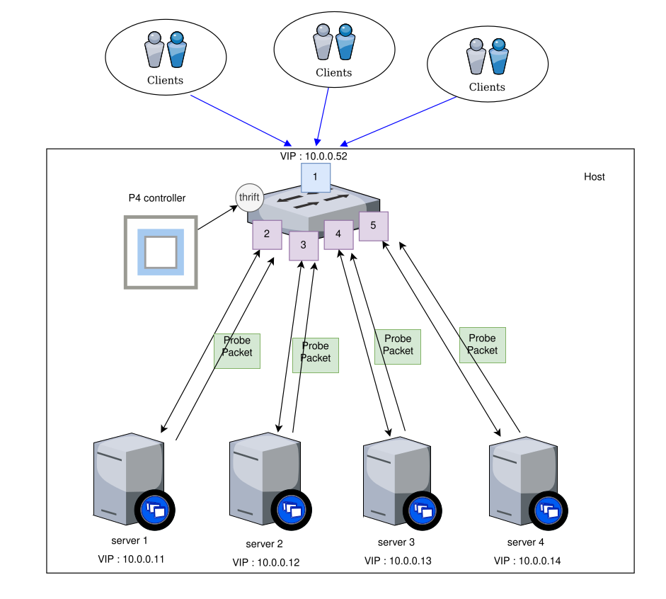
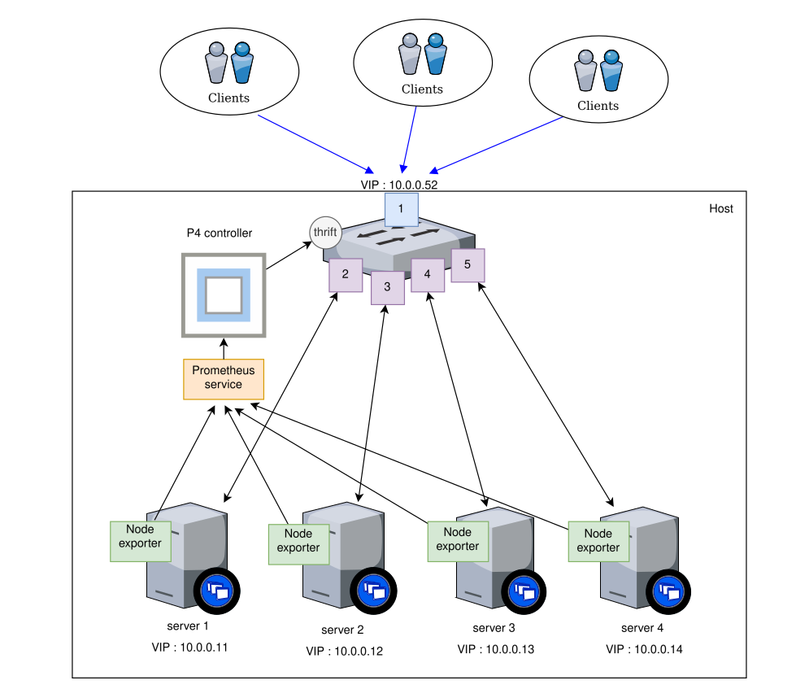
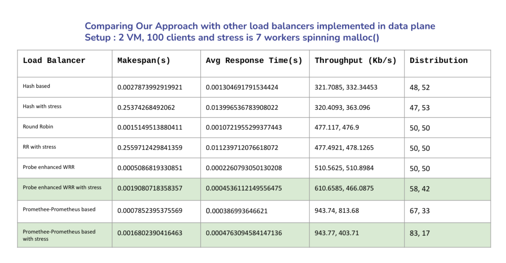

# Adaptive Load Balancing in P4: The Power of Promethee-Prometheus and Probes
## B.Tech final year project.

This repository contains the implementation of a dynamic load balancing solution designed to optimize resource utilization in virtualized environments. It was developed as part of our BTech project and focuses on utilizing the flexibility and programmability of the P4 language to enhance network performance, particularly in load balancing scenarios. The project is a collaboration between two team members, and it addresses the limitations of traditional load balancing techniques in the context of virtualized resources.

## 🚀 **Overview**

With the increasing demand for network services, efficient load balancing is essential to ensure optimal system performance. Traditional load balancing techniques often fail to address the dynamic and scalable nature of virtualized environments. This project proposes two innovative load balancing approaches, which adjust in real-time based on resource utilization metrics such as CPU, memory, and network usage.

## ⚡ **Key Features**

### 1. **Probe Enhanced Weighted Round Robin (WRR) Load Balancing**

- This algorithm collects regular **probes** from virtual machines, including CPU, memory, and link utilization metrics.
- The probes are encapsulated in a custom header and transmitted to the **P4 switch**, where the load balancer calculates a weighted mean based on pre-determined weights.
- The dynamic weights adjust according to **resource usage**, optimizing load distribution with an idle timeout mechanism to optimize resource usage.
- Ensures that failed VMs are excluded from receiving further requests..

### 2. **Promethee-Prometheus Driven Load Balancing**

- Integrates the **Promethee II algorithm** and **Analytic Hierarchy Process (AHP)** to dynamically select the optimal VM based on real-time system metrics.
- Prometheus is used to monitor and collect metrics from VMs, and these metrics are used in conjunction with AHP to determine the relative importance of CPU, memory, and network metrics for load balancing decisions.
- The Promethee II algorithm ranks VMs based on performance and helps distribute traffic to the most suitable VM, ensuring efficient resource utilization.

## 🚀 **Setup and Execution**

The project can be emulated using a P4 environment, where the setup includes the configuration of P4 switches and Prometheus for real-time metrics collection. Detailed setup instructions and code are provided in the repository for easy replication and experimentation.

## 🛠️ Design Challenges and Our Approach

During the development of the dynamic load balancing solution, we encountered and addressed several key design challenges, which we have mentioned in our report. Some of the key challenges were:

### 1. Maintaining Client-VM Connections
To ensure **session persistence** we have employed natting using **hashing mechanism** in P4 switch. This ensures that each client’s requests are consistently routed to the same virtual machine (VM), maintaining session continuity.

### 2. Idle Timeout Mechanism
To optimize load balancing and resource usage, we implemented an **idle timeout mechanism**. This ages out unused connections, ensuring that VMs are not burdened with idle flows. Traffic is reallocated to the most suitable VMs based on current load conditions.

### 3. VM Failure Detection
To maintain **high availability** and **reliability**, we incorporated **health checks** to monitor VM status. If a VM becomes unresponsive or fails, traffic is automatically rerouted to healthy VMs, ensuring uninterrupted service.

## 🔧 **Technologies Used**
- **P4 Language** for data plane programming and packet processing.
- **Prometheus** for real-time system monitoring and metric collection.
- **AHP** & **Promethee II** for dynamic decision-making in load balancing.

## 📊 **Conclusion**

This project demonstrates the power of **P4’s programmability** to create a dynamic and efficient load balancing solution for virtualized environments. By utilizing **real-time metrics**, the system adapts to varying resource demands and outperforms traditional static load balancing methods. Following is the snapshot of the observations we gained while comparing our approach with other traditional algorithms:

## 🙋 **Contributors**
- **[Yukta Salunkhe]**
- **[Mangesh Dalvi]**

---

We know there is a lot that can be further improved upon. Feel free to explore the code, run experiments, and contribute to the project! 😊
Your contributions, feedback, and suggestions are always welcome. Let's make this project even better together!

---

## Tags
- **P4**  
- **Load Balancing**  
- **Virtualization**  
- **Prometheus**  
- **Dynamic Traffic Distribution**  
- **Network Optimization**  
- **BTech Project**  
- **VM Resource Monitoring**  
- **AHP**  
- **Promethee II**  
- **P4Switch**  
- **Cloud Computing**
